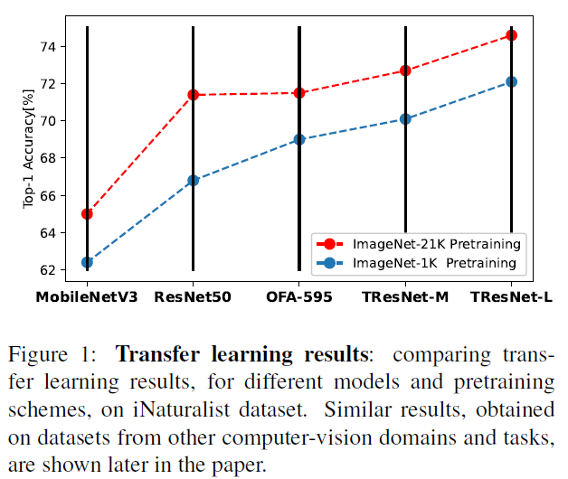

# ImageNet-21K-P Pretraining for the Masses

<br>[Paper](TBD) |
[Pretrained models](MODEL_ZOO.md)

Official PyTorch Implementation

> Tal Ridnik, Emanuel Ben-Baruch, Asaf Noy, Lihi Zelnik-Manor<br/> DAMO Academy, Alibaba
> Group

**Abstract**

Compared to standard ImageNet (1K), ImageNet-21K dataset is used less frequently for pretraining, mainly due to its complicated tagging methodology, longer training times, and underestimation of its added value to models of different sizes.
This paper aims to close this gap and make high-quality efficient pretraining on ImageNet-21K available for anyone.
Via a dedicated preprocessing stage, utilizing WordNet hierarchies, and a novel training scheme called semantic softmax, we show that different models, including small mobile-oriented models, significantly benefit from ImageNet-21K pretraining on numerous datasets and tasks.
We also show that we outperform previous ImageNet-21K pretraining schemes for prominent new models like ViT.
Our proposed pretraining pipeline is efficient, accessible, and leads to SoTA reproducible results, from a publicly available dataset.
<p align="center">
  <table  class="tg">
    <td class="tg-c3ow"></td>
</table>
 <table>
  <tr>
    <td class="tg-c3ow"></td>
    <td class="tg-c3ow"></td>
  </tr>
  </table>
</p>

## Getting Started

Note - repo under construction, more contetnt will be added soon.

### (1) Pretrained Models
In this [link](MODEL_ZOO.md) you can download  weights for various models, pretrained on ImageNet-21K-P dataset.

We highly recommend to start working with ImageNet-21K by testing these weights against your current pretraining, and compare results on relevant downstream tasks.
After you will see a significant improvement (and you will), you should proceed to pretraining new models.

### (2) Obtaining and Processing the Dataset
See instructions for obtaining and processing the dataset in [here](./dataset_processing/processing_instructions.md).


### (3) Training Code
To use the traing code, first download ImageNet-21K-P [semantic tree](https://miil-public-eu.oss-eu-central-1.aliyuncs.com/model-zoo/ImageNet_21K_P/resources/imagenet21k_tree.pth) to your local ./resources/ folder
Example of semantic softmax training:
```
python train_semantic_softmax.py \
--batch_size=4 \
--data_path=/mnt/datasets/21k \
--model_name=mobilenetv3_large_100 \
--model_path=/mnt/models/mobilenetv3_large_100.pth \
--epochs=80
```
We initilize our training from standard ImageNet-1K to shorten it. Recommended to use ImageNet-1K weights from the excellent [repo](https://github.com/rwightman/pytorch-image-models).

## To be added soon
- KD training code
- Inference code
- Model weights when transferred to ImageNet-1K
- More...

## Citation
```
tbd
```
