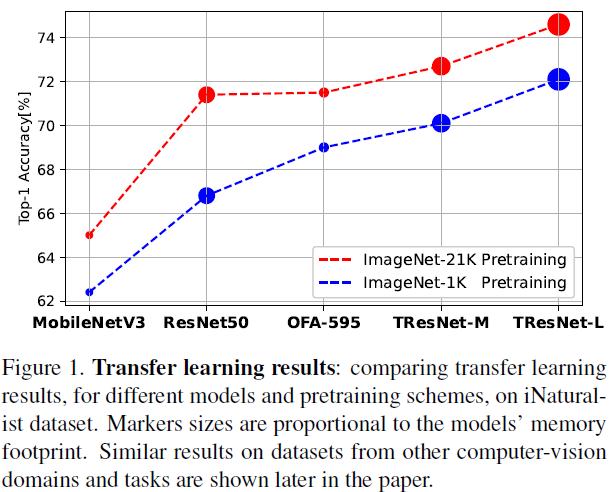

# ImageNet-21K Pretraining for the Masses

<br>[Paper](https://arxiv.org/pdf/2104.10972) |
[Pretrained models](MODEL_ZOO.md)

Official PyTorch Implementation

> Tal Ridnik, Emanuel Ben-Baruch, Asaf Noy, Lihi Zelnik-Manor<br/> DAMO Academy, Alibaba
> Group

**Abstract**

ImageNet-1K serves as the primary dataset for pretraining deep learning models for computer vision tasks. ImageNet-21K dataset, which contains more pictures and classes, is used less frequently for pretraining, mainly due to its complexity, and underestimation of its added value compared to standard ImageNet-1K pretraining.
This paper aims to close this gap, and make high-quality efficient pretraining on ImageNet-21K available for everyone.
Via a dedicated preprocessing stage, utilizing WordNet hierarchies, and a novel training scheme called semantic softmax, we show that different models, including small mobile-oriented models, significantly benefit from ImageNet-21K pretraining on numerous datasets and tasks.
We also show that we outperform previous ImageNet-21K pretraining schemes for prominent new models like ViT.
Our proposed pretraining pipeline is efficient, accessible, and leads to SoTA reproducible results, from a publicly available dataset.
<p align="center">
  <table  class="tg">
    <td class="tg-c3ow"></td>
</table>
 <table>
  <tr>
    <td class="tg-c3ow"></td>
    <td class="tg-c3ow"></td>
  </tr>
  </table>
</p>

## Getting Started

Note - repo under construction, more contetnt will be added.

### (1) Pretrained Models  on ImageNet-21K-P Dataset
| Backbone  |  ImageNet-21K-P semantic<br> top-1 Accuracy <br>[%] | ImageNet-1K<br> top-1 Accuracy <br>[%] | Maximal <br> batch size | Maximal <br> training speed <br>(img/sec) | Maximal <br> inference speed <br>(img/sec) |
| :------------: | :--------------: | :--------------: | :--------------: | :--------------: | :--------------: |
[MobilenetV3_large_100](https://miil-public-eu.oss-eu-central-1.aliyuncs.com/model-zoo/ImageNet_21K_P/models/mobilenetv3_large_100_miil_21k.pth) | 73.1 | 78.0 | 488 | 1210 | 5980 |
[OFA_flops_595m_s](https://miil-public-eu.oss-eu-central-1.aliyuncs.com/model-zoo/ImageNet_21K_P/models/ofa_flops_595m_s_miil_21k.pth) | 75.0 | 81.0 | 288 | 500 | 3240 |
[ResNet50](https://miil-public-eu.oss-eu-central-1.aliyuncs.com/model-zoo/ImageNet_21K_P/models/resnet50_miil_21k.pth) | 75.6 | 82.0 | 320 | 720 | 2760 |
[TResNet-M](https://miil-public-eu.oss-eu-central-1.aliyuncs.com/model-zoo/ImageNet_21K_P/models/tresnet_m_miil_21k.pth) | 76.4 | 83.1 | 520 | 670 | 2970 |
[TResNet-L (V2)](https://miil-public-eu.oss-eu-central-1.aliyuncs.com/model-zoo/ImageNet_21K_P/models/tresnet_l_v2_miil_21k.pth) | 76.7 | 83.9 | 240 | 300 | 1460 |
[ViT_base_patch16_224](https://miil-public-eu.oss-eu-central-1.aliyuncs.com/model-zoo/ImageNet_21K_P/models/vit_base_patch16_224_miil_21k.pth) | 77.6 | 84.4 | 160 | 340 | 1140 |

See this [link](MODEL_ZOO.md) for more details.
<br>
We highly recommend to start working with ImageNet-21K by testing these weights against standard ImageNet-1K pretraining, and comparing results on your relevant downstream tasks.
After you will see a significant improvement (you will), proceed to pretraining new models.

### (2) Obtaining and Processing the Dataset
See instructions for obtaining and processing the dataset in [here](./dataset_preprocessing/processing_instructions.md).


### (3) Training Code
To use the traing code, first download ImageNet-21K-P [semantic tree](https://miil-public-eu.oss-eu-central-1.aliyuncs.com/model-zoo/ImageNet_21K_P/resources/imagenet21k_tree.pth) to your local ./resources/ folder
Example of semantic softmax training:
```
python train_semantic_softmax.py \
--batch_size=4 \
--data_path=/mnt/datasets/21k \
--model_name=mobilenetv3_large_100 \
--model_path=/mnt/models/mobilenetv3_large_100.pth \
--epochs=80
```
For shortening the training, we initialize the weights from standard ImageNet-1K. Recommended to use ImageNet-1K weights from this excellent [repo](https://github.com/rwightman/pytorch-image-models).

## To be added soon
- KD training code
- Inference code
- Model weights after transferred to ImageNet-1K
- More...

## Citation
```
@misc{ridnik2021imagenet21k,
      title={ImageNet-21K Pretraining for the Masses}, 
      author={Tal Ridnik and Emanuel Ben-Baruch and Asaf Noy and Lihi Zelnik-Manor},
      year={2021},
      eprint={2104.10972},
      archivePrefix={arXiv},
      primaryClass={cs.CV}
}
```
